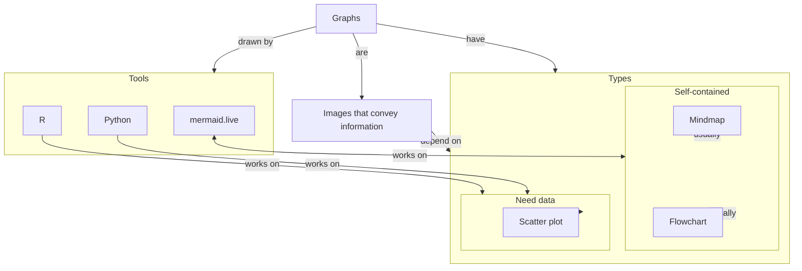

# iseugierufbwebfoefr

```mermaid
flowchart TD
  graphs[Graphs]
  images[Images that convey information]
  subgraph types[Types]
    subgraph self_contained[Self-contained]
    mindmap[Mindmap]
    a_flowchart[Flowchart]
    end
    subgraph need_data[Need data]
      scatter_plot[Scatter plot]
    end
  end
  subgraph tools[Tools]
    Mermaid_live[mermaid.live]
    python[Python]
    r[R]
  end

  graphs --> |are| images
  images --> |depend on| types
  graphs --> |have| types
  mindmap --> |usually| self_contained
  a_flowchart --> |usually| self_contained
  scatter_plot --> need_data

  graphs --> |drawn by| tools

  Mermaid_live <--> |works on|self_contained
  python --> |works on| need_data
  r --> |works on| need_data
```

